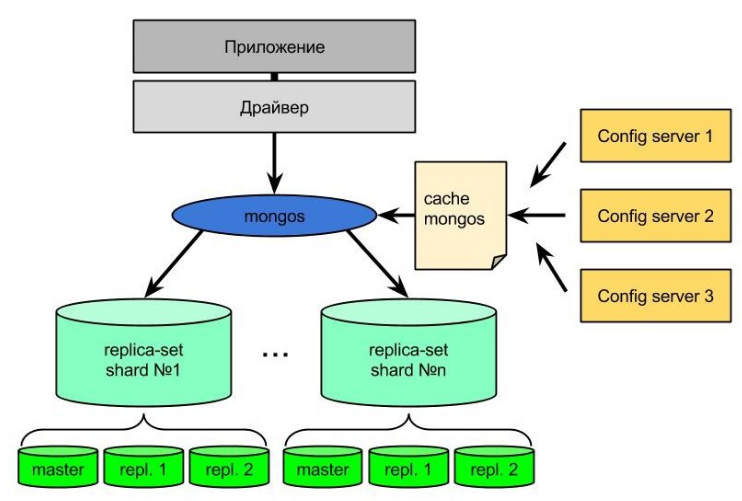
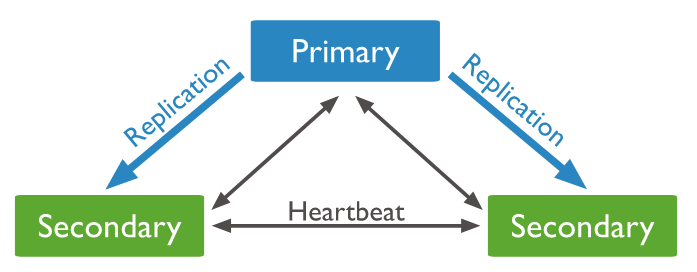
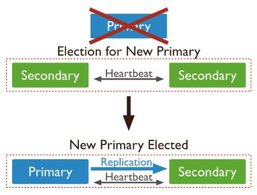
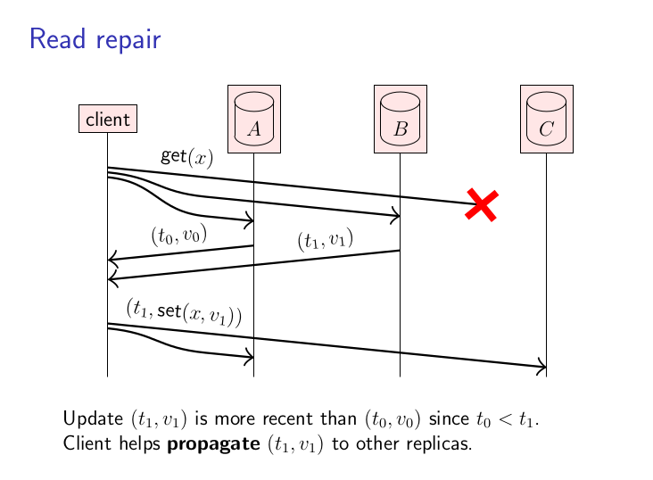

# otus-nosql-cap
CAP theorem

## Терминология

CAP теорема - эвристическое утверждение, о том что распределенная система может в лучшем случае принадлежать к одному из двух классов **AP** или **CP**.

Проясним значение каждой литеры отдельно:
* **Consistency** (C) - сам по себе термин сильно перегружен. В акрониме **ACID** он означает, что БД поддерживает внутренние инварианты (уникальность значения в колонке, не отрицательность какой-либо колонки, целостность внешних ключей). В рамках же **CAP** теоремы он означает линеаризуемость (**linearizability**).
* **Availability** (A) - любой запрос к работающему узлу системы должен приводить к ответу.
* **Partition tolerance** (P) - устойчивость к разделению узлов. Узлы системы могут продолжать работать даже при условии отсутствия связи между ними.

**Linearizability** - модель консистентность. Говорят, что система обеспечивает линеаризуемость если выполняется следующее условие:
```
Если операция В началась после успешного завершения операции А, тогда операция В должна видеть состояние системы в момент завершении А или же в новом состоянии.
```

Неформально говоря линеаризуемые системы создают у пользователя иллюзию, что он работает с единой копией данных.


## MongoDb

Документо-ориентированная база данных.

Схема кластера MongoDB.



Схема replica-set



Внутри каждой replica-set осуществляется выбор primary ноды, который отвечает за все операции записи.
Операции чтения/записи используют концепцию read/write concern.

Возможные значения write concern
* majority - операция записи считается успешно зафиксированной, если запись реплицировалась на большинство узлов (например на 1 secondary реплику если в replica-set 3 узла, на 2 secondary реплики если в replica-set 5 узлов).
* number - операция записи считается успешно зафиксированной, если запись реплицировалась на <number> secondary реплик.
* custom - например используется в случае multi datacenter кластеров.

Я предполагаю, что MongoDB можно считать **CP** системой если используется write concern с фиксацией записи в primary ноде и "linearizable" read concern.
Ограничения
* Операция чтения может затрагивать только один документ.
* Операция чтения в силу "linearizable" read concern проходит только через primary ноду.

Я считаю, что MongoDB не может считаться **AP** системой в силу того, что все операции записи в replica-set проходят через primary ноду. В случае отказа primary ноды проходит новый раунд выборов.



Длительность этого процесса регулируется конфигурацией `electionTimeoutMillis` (по умолчанию 10 секунд). Согласно документации MongoDB медианное время выборов не превосходит 12 секунд. В этот момент система не сможет принимать запросы на запись с подтверждением фиксации.

Вывод: C теоретической точки зрения MongoDB можно отнести к **CP** системам при операциях над одним документом.

## Cassandra

Dynamo-style хранилище типа KV. Использует кворумную репликацию и стратегию разрешения конфликтов LWW (last write wins) с использованием обычных часов.

Репликация с использованием кворума


Декларируется, что Cassandra обладает tunable consistency.

Можно с уверенностью отнести Cassandra к **AP** системам при соответствующем выборе read/write кворума.

Dynamo-style системы могут быть также и линериазуемыми в случае использования техники read-repair при операции чтения. 



Однако Cassandra все же не **CP** система в силу, того что она использует физическое время для разрешения конфликтов. В силу невозможности синхронизировать часы на разных узлах нет возможности и установить порядок событий в системе.

Единственным исключением является операция **CAS** использующая механизм **lightweight transaction**. В этом случае Cassandra использует алгоритм Paxos для репликации данных.
Возможно только в этой ситуации можно рассчитывать на линеаризуемость, если последующая операция чтения используется major кворум.

Вывод: Cassandra является **AP** системой.

## MSSQL

Реляционная СУБД.

В случае stand-alone конфигурации система не является распределенной и это вырожденный случай.
В случае использования репликации можно рассмотреть два варианта:
* Асинхронная репликация. При чтении с реплик мы теряем консистентность из-за наличия лага репликации. В то же время при отказе ведущего узла какое-то время отсутствует доступность.
* Синхронная репликация. В принципе консистентность сохраняется, однако доступность на запись сильно ухудшается (если `p` вероятность отказа узла, то вероятность отказа становится `3 * p` при наличии двух реплик).

Вывод: Не **AP** и **CP** в случае асинхронной репликации. **CP** в случае синхронной.